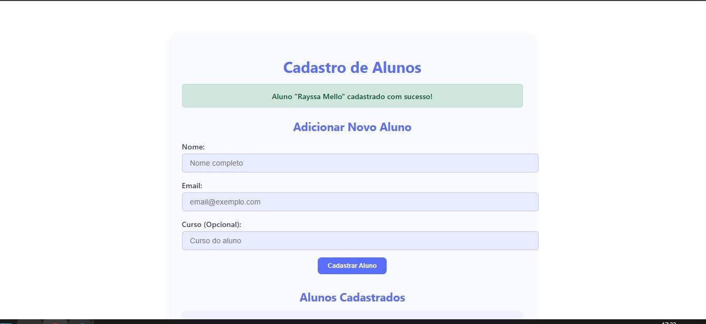
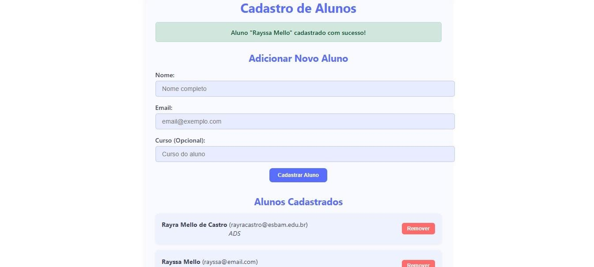

# 📚 Cadastro de Alunos

Este é um sistema de cadastro de alunos, com funcionalidades de listagem, criação, edição e exclusão de registros. O projeto é dividido em **frontend** (React) e **backend** (Node.js + Express + SQLite).
# Sistema Web de Agendamento

  
  

Veja como as telas do sistema ficam lado a lado.

---

## 🚀 Tecnologias Utilizadas

- **Frontend:**
  - React
  - JavaScript
  - CSS

- **Backend:**
  - Node.js
  - Express
  - SQLite3

---

✅ Funcionalidades
 Cadastrar alunos

 Listar alunos

 Editar informações

 Excluir alunos

🧠 Atividade pratica

Projeto desenvolvido por Rayra Mello como prática de desenvolvimento Full Stack com React e Node.js.

